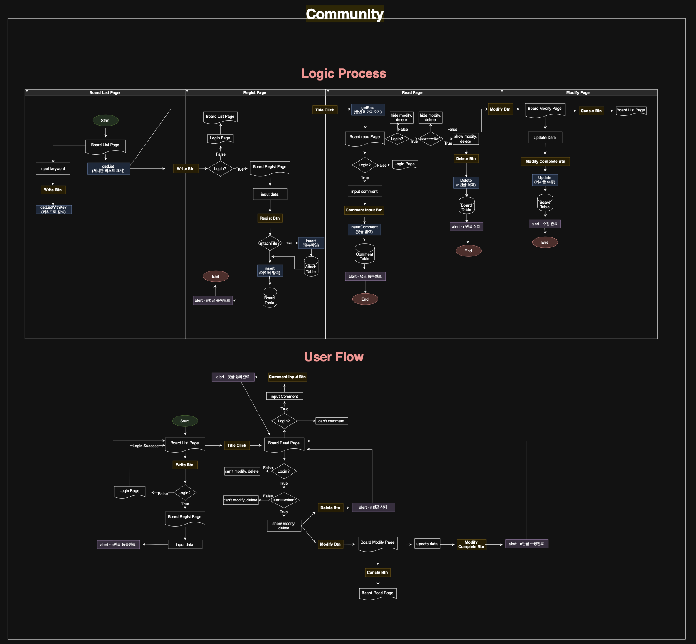

# 🧗‍♀️ 한계돌파 (HanGyeDolpa)

**한계돌파**는 클라이밍 애호가들을 위한 통합 플랫폼으로, 사용자 운동 관리, 커뮤니티 기능, 그리고 클라이밍 정보 공유를 제공합니다.

---

## 📌 프로젝트 개요

- **팀명**: 한계돌파  
- **진행 기간**: 2025년 1월 8일 ~ 2월 12일  
- **시연 영상**: [YouTube 링크](https://youtu.be/klWPggb3VNA)

---

## 🛠 기술 스택

- **백엔드**: Java 17, Spring Boot, Maven  
- **프론트엔드**: HTML5, CSS3, JavaScript  
- **데이터베이스**: MySQL  
- **지도 API**: Kakao Maps API 

---

## 🚀 주요 기능

- **사용자 인증**: 카카오 OAuth를 통한 소셜 로그인 기능  
- **루트 추천 시스템**: 사용자 선호도 기반 맞춤형 클라이밍 루트 추천  
- **커뮤니티 게시판**: 사용자 간 정보 공유 및 소통을 위한 게시판 기능  
- **실시간 정보 공유**: 클라이밍 장소의 실시간 정보 제공  
- **지도 연동**: Kakao Maps API를 활용한 클라이밍 장소 시각화

---

## 🔄 Logic Process & User Flow

한계돌파 프로젝트의 전반적인 비즈니스 로직 흐름 및 사용자의 서비스이용 흐름은 다음과 같습니다:

<p align="center">
    

- 전체 비즈니스 로직 & 유저 플로우: [링크](https://drive.google.com/file/d/1dMtot9WwY92goMBYE-9Rx12_vqZ2RWie/view?usp=sharing)

## 환경 설정

### 🗺️ 지도 관련 키 설정

- `MapService.java` → **29번째 줄**

    ```
    private final String REST_API_KEY = "YOUR_KAKAO_APIKEY";
    ```

- `mapLocation.html` → **13번째 줄**

    ```
    <script type="text/javascript" src="//dapi.kakao.com/v2/maps/sdk.js?appkey=YOUR_KAKAO_KEY"></script>
    ```

### 🖼️ 업로드 파일 경로 설정

- `UploadController.java`  
    - **40번째 줄**:

    ```
    private static final String FILE_UPLOAD_PATH = "/your/upload/path/";
    ```

    - **139번째 줄**:

    ```
    File file = new File(FILE_UPLOAD_PATH + fileName);
    ```
